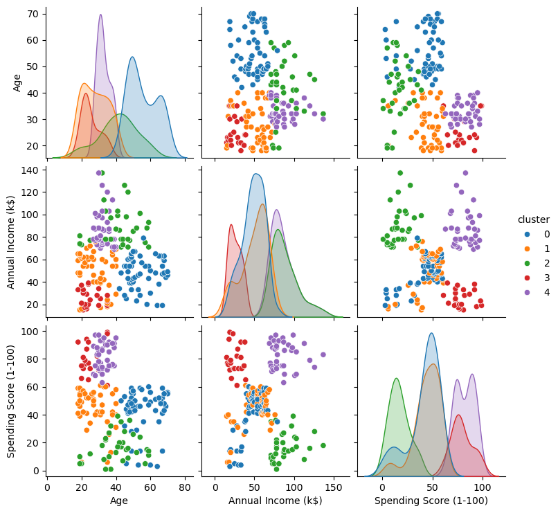
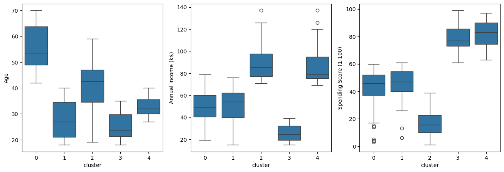

# Segmentação de clientes de um supermercado

Um supermercado, através de cartões de fidelidade, possui alguns dados básicos sobre seus clientes, como idade, gênero, renda anual e pontuação de gastos. Tal pontuação é algo que o supermercado atribui ao cliente com base em parâmetros definidos, como comportamento do cliente e dados de compra.

A pontuação de gastos é uma métrica interna criada pelo supermercado, baseada em parâmetros como comportamento de compra, frequência de visitas e volume de consumo.

## Objetivos 

* Realizar a clusterização com pré-processamento dos dados.
* Apresentar uma estrutura de projeto de Ciência de Dados, com a utilização de notebooks, scripts, relatórios e repósitorio no GitHub.
* Apresentar boas práticas de programação Python, utilizando Pandas, Matplotlib, Seaborn 
* Mostrar boas práticas de uso do SciKit-Learn, com a utilização de pipelines.
* Explorar e compreender o comportamento dos clientes.
* Identificar padrões e possíveis segmentações.

Este estudo demonstra a aplicação de técnicas de análise exploratória de dados (EDA) e interpretação de dados de negócio, simulando um cenário real do varejo.

O dataset utilizado neste projeto não é versionado no repositório. Ele pode ser obtido em: [Kaggle](https://www.kaggle.com/vjchoudhary7/customer-segmentation-tutorial-in-python)

## Estrutura do repositório

O repositório está estruturado da seguinte forma:

```
├── dados
├── imagens
├── modelos
├── notebooks
├── reports
```

* Na pasta `dados` estão os dados utilizados no projeto. O arquivo `Mall_Customers.csv` é o dataset utilizado originalmente. Os demais arquivos são os datasets gerados durante o projeto.
* Na pasta `imagens` estão os gráficos utilizados no projeto.
* Na pasta `modelos` estão os modelos gerados durante o projeto.
* Na pasta `notebooks` estão os notebooks com o desenvolvimento do projeto. Em detalhes, temos:
  
     -  [Describe](notebooks/01-gm-describe.ipynb) - Descrição da base, verificando as informações das colunas, valores nulos e entre outros procedimentos. 
     -  [EDA](notebooks/02-gm-eda.ipynb) - Análise exploratória dos dados usando a bibloteca [ydata-profiling](https://github.com/ydataai/ydata-profiling).
     -  [Clustering](notebooks/03-gm-clustering.ipynb) - Clusterização dos dados usando K-Means com pré-processamento utilizando pipelines do Scikit-Learn.
     -  [Pipeline_Pca](notebooks/04-gm-pipeline_pca.ipynb) - Clusterização dos dados usando K-Means após redução de dimensionalidade com PCA utilizando pipelines do Scikit-Learn.
     -  [funcoes_auxiliares](notebooks/funcoes_auxiliares.py) - Arquivo com funções auxiliares utilizadas nos notebooks.

* Na pasta `reports` estão os relatórios gerados durante o projeto utilizando a bibloteca [ydata-profiling](https://github.com/ydataai/ydata-profiling).

## Detalhes do dataset utilizado e resumo dos resultados
O dataset utilizado é o contido no arquivo [`Mall_Customers.csv`](dados/Mall_Customers.csv), que contém os seguintes dados:
- `CustomerID`: ID do cliente
- `Gender`: sexo do cliente
- `Age`: idade do cliente
- `Annual Income (k$)`: renda anual do cliente
- `Spending Score (1-100)`: pontuação de gastos do cliente





- Cluster 0 - pontuação de gastos moderada, renda moderada, idade alta
- Cluster 1 - pontuação de gastos moderada, renda moderada, idade jovem
- Cluster 2 - pontuação de gastos baixa, renda alta, idade moderada
- Cluster 3 - pontuação de gastos alta, renda baixa, idade jovem
- Cluster 4 - pontuação de gastos alta, renda alta, idade jovem

Transformando os pontos acima em uma tabela:

| Pontuação de Gastos | Renda    | Idade    | Cluster |
| ------------------- | -------- | -------- | ------- |
| Moderada            | Moderada | Alta     | 0       |
| Moderada            | Moderada | Jovem    | 1       |
| Baixa               | Alta     | Moderada | 2       |
| Alta                | Baixa    | Jovem    | 3       |
| Alta                | Alta     | Jovem    | 4       |

## Como reproduzir o projeto

O projeto foi desenvolvido utilizando o Python 3.13.5 Para reproduzir o projeto, crie um ambiente virtual com o Conda, ou ferramenta similar, com o Python 3.13.5 e instale as bibliotecas abaixo:

| Biblioteca   | Versão |
| ------------ | ------ |
| Matplotlib   | 3.10.0  |
| NumPy        | 2.1.3 |
| Pandas       | 2.2.3  |
| Scikit-Learn | 1.6.1  |
| Seaborn      | 0.13.2 |

<a href="https://www.linkedin.com/in/gregory-moliner-a65baa13a" target="_blank">
  
